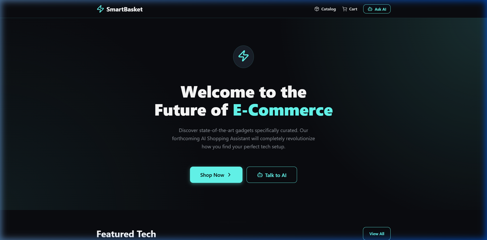
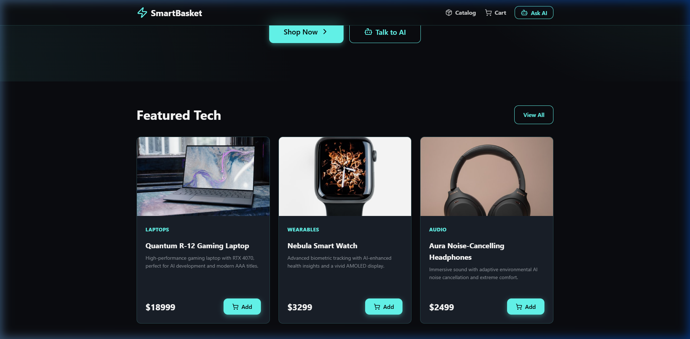
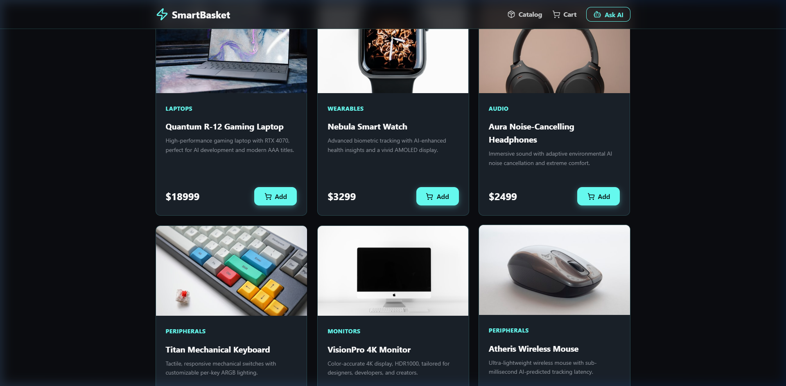
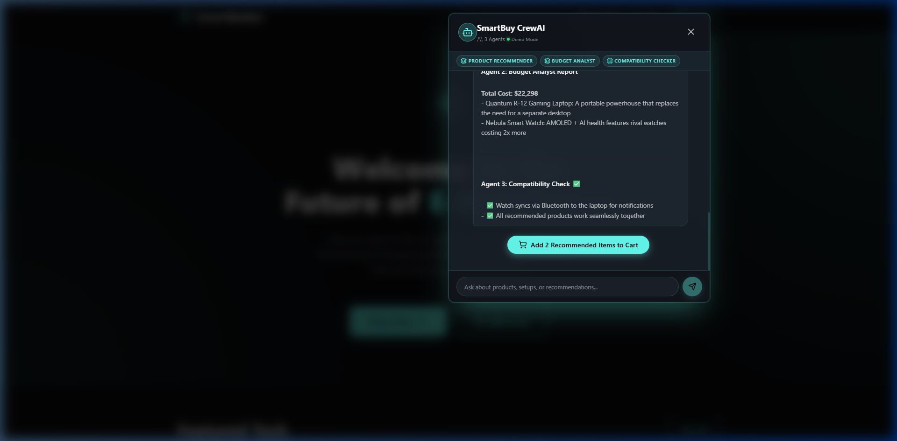

# CrewAI Implementation Report
**Project:** SmartBasket E-Commerce  
**Course:** Advanced Web Development — CrewAI Assignment  
**Date:** April 2026

---

## 1. Project Overview

SmartBasket is a glassmorphism-themed e-commerce platform for tech enthusiasts. This assignment extends the existing Homework 2 project by integrating **CrewAI** — a multi-agent AI orchestration framework — to power an intelligent shopping assistant.

The AI assistant uses **3 specialized agents** (Product Recommender, Budget Analyst, Compatibility Checker) working in a **sequential pipeline** to analyze user queries and generate comprehensive product recommendations.

### System Architecture
```
┌────────────────────────────────────────────────────────────┐
│                     REACT FRONTEND                         │
│  ┌──────────────────────────────────────────────────────┐  │
│  │           AIAssistantModal (Chat UI)                 │  │
│  │  - User types natural language query                 │  │
│  │  - Sends POST /api/recommend                         │  │
│  │  - Renders markdown response                         │  │
│  │  - "Add to Cart" for recommended products            │  │
│  └─────────────────────┬────────────────────────────────┘  │
└────────────────────────┼───────────────────────────────────┘
                         │ HTTP POST (JSON)
                         ▼
┌────────────────────────────────────────────────────────────┐
│                   FASTAPI BACKEND                          │
│  ┌─────────────────────────────────────────────────────┐   │
│  │  main.py — API Server (CORS, Endpoints)             │   │
│  │  POST /api/recommend → crew.py kickoff              │   │
│  └─────────────────────┬───────────────────────────────┘   │
│                        ▼                                   │
│  ┌─────────────────────────────────────────────────────┐   │
│  │  crew.py — CrewAI Orchestration (KICKOFF)           │   │
│  │                                                     │   │
│  │  ┌───────────┐  ┌────────────┐  ┌───────────────┐  │   │
│  │  │ Product   │→ │ Budget     │→ │ Compatibility │  │   │
│  │  │Recommender│  │ Analyst    │  │ Checker       │  │   │
│  │  └───────────┘  └────────────┘  └───────────────┘  │   │
│  │       ↓               ↓               ↓            │   │
│  │  [Task 1+2]      [Task 3]        [Task 4]         │   │
│  │  Analyze &        Budget          Compatibility     │   │
│  │  Recommend        Analysis        Verification      │   │
│  └─────────────────────┬───────────────────────────────┘   │
│                        ▼                                   │
│  ┌─────────────────────────────────────────────────────┐   │
│  │  recommender.py — Smart Recommendation Engine       │   │
│  │  (Multi-category detection, scoring, budget filter) │   │
│  └─────────────────────────────────────────────────────┘   │
│                        ▼                                   │
│  ┌─────────────────────────────────────────────────────┐   │
│  │  config/agents.yaml — Agent definitions             │   │
│  │  config/tasks.yaml  — Task definitions              │   │
│  │  products.py — Product catalog with specs           │   │
│  └─────────────────────────────────────────────────────┘   │
└────────────────────────────────────────────────────────────┘
                         │
                         ▼ (when API key configured)
                ┌─────────────────┐
                │   OpenAI API    │
                │   (GPT-4/3.5)   │
                └─────────────────┘
```

---

## 2. CrewAI Agents

Three agents are defined in `backend/config/agents.yaml` and instantiated in `backend/agents.py`.

### Agent 1: Product Recommender

```yaml
# backend/config/agents.yaml
product_recommender:
  role: "Senior Product Recommender"
  goal: >
    Analyze customer needs and recommend the most suitable products
    from the SmartBasket catalog. Match user requirements with
    product specifications, use-cases, and categories.
  backstory: >
    You are an expert technology consultant with 15 years of experience
    in consumer electronics. You have deep knowledge of gaming laptops,
    monitors, peripherals, wearables, and audio equipment.
  verbose: true
  allow_delegation: true
```

**Python Agent Creation:**
```python
# backend/agents.py
from crewai import Agent

def create_product_recommender(llm=None):
    config = load_agent_config()
    cfg = config['product_recommender']
    
    return Agent(
        role=cfg['role'],
        goal=cfg['goal'],
        backstory=cfg['backstory'],
        verbose=cfg.get('verbose', True),
        allow_delegation=cfg.get('allow_delegation', True),
        llm=llm
    )
```

### Agent 2: Budget Analyst

```yaml
budget_analyst:
  role: "Budget & Value Analyst"
  goal: >
    Evaluate the cost-effectiveness of product recommendations and
    ensure they fit within the customer's budget constraints.
  backstory: >
    You are a financial advisor specializing in technology purchases.
    You understand the price-to-performance ratio of every product
    category.
  verbose: true
  allow_delegation: false
```

### Agent 3: Compatibility Checker

```yaml
compatibility_checker:
  role: "Tech Compatibility Specialist"
  goal: >
    Verify that recommended products are compatible with each other
    and with the user's existing setup.
  backstory: >
    You are a systems integration engineer who ensures all recommended
    products work harmoniously together.
  verbose: true
  allow_delegation: false
```

---

## 3. CrewAI Tasks

Four tasks are defined in `backend/config/tasks.yaml` and created in `backend/tasks.py`.

### Task 1: Analyze Customer Needs
```python
# backend/tasks.py
def create_analyze_needs_task(agent, customer_query, product_catalog_str):
    config = load_task_config()
    cfg = config['analyze_needs']
    
    description = cfg['description'].format(
        customer_query=customer_query,
        product_catalog=product_catalog_str
    )
    
    return Task(
        description=description,
        expected_output=cfg['expected_output'],
        agent=agent
    )
```

### Task 2: Recommend Products
```python
def create_recommend_products_task(agent, product_catalog_str, context_tasks=None):
    config = load_task_config()
    cfg = config['recommend_products']
    
    return Task(
        description=cfg['description'].format(product_catalog=product_catalog_str),
        expected_output=cfg['expected_output'],
        agent=agent,
        context=context_tasks  # Chains output from Task 1
    )
```

### Task 3: Budget Analysis
Receives context from Tasks 1 & 2. Evaluates total cost and value-for-money.

### Task 4: Compatibility Check
Receives context from Tasks 2 & 3. Verifies all products work together.

---

## 4. Crew Kickoff Code

The `crew.py` file orchestrates all agents and tasks:

```python
# backend/crew.py
from crewai import Crew, Process
from agents import create_all_agents
from tasks import (
    create_analyze_needs_task,
    create_recommend_products_task,
    create_budget_analysis_task,
    create_compatibility_check_task
)
from products import get_catalog_string

def create_smart_basket_crew(customer_query: str, llm=None):
    catalog_str = get_catalog_string()
    agents = create_all_agents(llm=llm)
    
    recommender = agents["product_recommender"]
    budget = agents["budget_analyst"]
    compatibility = agents["compatibility_checker"]
    
    # Create tasks with context chaining
    task1 = create_analyze_needs_task(recommender, customer_query, catalog_str)
    task2 = create_recommend_products_task(recommender, catalog_str, [task1])
    task3 = create_budget_analysis_task(budget, customer_query, catalog_str, [task1, task2])
    task4 = create_compatibility_check_task(compatibility, catalog_str, [task2, task3])
    
    # Assemble crew with sequential process
    crew = Crew(
        agents=[recommender, budget, compatibility],
        tasks=[task1, task2, task3, task4],
        process=Process.sequential,
        verbose=True
    )
    return crew

def kickoff_crew(customer_query: str, llm=None):
    crew = create_smart_basket_crew(customer_query, llm=llm)
    result = crew.kickoff()
    return result
```

**Key Design Decisions:**
- **Sequential Process**: Tasks run one after another, each building on previous results
- **Context Chaining**: Each task receives relevant output from prior tasks via the `context` parameter
- **YAML Configuration**: Agent roles and task descriptions are externalized to YAML files for easy modification

---

## 5. Smart Recommendation Engine (recommender.py)

When running without an OpenAI API key, the backend uses a sophisticated **keyword-scoring recommendation engine** that simulates the multi-agent behavior with deterministic logic.

### Multi-Category Detection Algorithm

The engine uses a **multi-category detection** system to handle complex queries that mention multiple product types. This was specifically designed to address queries like *"I need a keyboard and watch"* where multiple distinct product categories are requested.

**How it works:**

1. **Keyword Scoring**: Each word in the query is matched against a relevance map (`KEYWORD_RELEVANCE`) that assigns scores to product IDs. For example, "keyboard" scores product ID 4 at 10 points, "watch" scores product ID 2 at 10 points.

2. **Category Detection**: The engine identifies which distinct product categories the user explicitly mentioned by checking against `CATEGORY_KEYWORDS` mapping.

3. **Smart Selection Logic**:
   - **Multi-category** (2+ categories mentioned): Guarantees each explicitly requested category's best product is included in the recommendation.
   - **Single category**: Returns the specific product with an optional complementary product.
   - **Bundle requests** ("setup", "complete", "everything"): Returns top 3 products by score.
   - **General queries** (no specific product mentioned): Uses score-gap analysis to determine 1-3 recommendations.

4. **Budget Filtering**: Extracts budget constraints from queries (e.g., "$5000", "under 3000") and filters products accordingly.

```python
# Core multi-category detection logic
explicitly_requested_ids = set()
for kw, pid in CATEGORY_KEYWORDS.items():
    if kw in query_lower:
        explicitly_requested_ids.add(pid)

if len(explicitly_requested_ids) >= 2:
    # Guarantee each category's best product is included
    for pid in explicitly_requested_ids:
        for product, s in scored:
            if product["id"] == pid and pid not in used_ids:
                top_products.append((product, s))
                used_ids.add(pid)
                break
```

### Test Results

| Query | Recommended Product IDs | Products |
|-------|------------------------|----------|
| "I need a keyboard and watch" | [2, 4] | Nebula Smart Watch + Titan Keyboard ✅ |
| "I want a laptop, mouse and headphones" | [1, 3, 6] | Quantum Laptop + Aura Headphones + Atheris Mouse ✅ |
| "best gaming setup" | [1, 5, 3] | Quantum Laptop + VisionPro Monitor + Aura Headphones ✅ |
| "cheap peripherals" | [6, 4] | Atheris Mouse + Titan Keyboard ✅ |
| "I need a monitor" | [5] | VisionPro 4K Monitor ✅ |

---

## 6. Configuration Files

### agents.yaml
Defines agent `role`, `goal`, `backstory`, `verbose`, and `allow_delegation` settings for all 3 agents. Located at `backend/config/agents.yaml`.

### tasks.yaml
Defines task `description`, `expected_output`, and `agent` assignment for all 4 tasks. Uses `{customer_query}` and `{product_catalog}` template variables. Located at `backend/config/tasks.yaml`.

### .env.example
```
OPENAI_API_KEY=your_openai_api_key_here
HOST=0.0.0.0
PORT=8000
```

---

## 7. FastAPI Backend Server

The `main.py` file provides the REST API:

```python
# backend/main.py
from fastapi import FastAPI
from fastapi.middleware.cors import CORSMiddleware

app = FastAPI(title="SmartBasket CrewAI API")

app.add_middleware(CORSMiddleware, allow_origins=["*"], ...)

@app.post("/api/recommend")
async def get_recommendations(request: QueryRequest):
    # If OpenAI key configured → Live CrewAI
    # Otherwise → Smart Recommendation Engine (recommender.py)
    if use_live:
        from crew import kickoff_crew
        result = kickoff_crew(request.query)
        return RecommendationResponse(...)
    else:
        from recommender import generate_recommendation
        rec = generate_recommendation(request.query)
        return RecommendationResponse(...)
```

**API Endpoints:**
| Endpoint | Method | Description |
|----------|--------|-------------|
| `/` | GET | Health check |
| `/api/health` | GET | Server status & mode info |
| `/api/recommend` | POST | Main CrewAI recommendation endpoint |
| `/api/agents` | GET | Agent configuration info |
| `/api/tasks` | GET | Task configuration info |
| `/api/products` | GET | Product catalog |

---

## 8. Frontend Integration

The `AIAssistantModal.jsx` component functions as a real-time chat interface:

```jsx
// src/components/AIAssistantModal.jsx
const AIAssistantModal = ({ isOpen, onClose, addToCart, products }) => {
    const [messages, setMessages] = useState([...]);
    const [isLoading, setIsLoading] = useState(false);

    const handleSend = async () => {
        // Send user query to CrewAI backend
        const res = await fetch('http://localhost:8000/api/recommend', {
            method: 'POST',
            headers: { 'Content-Type': 'application/json' },
            body: JSON.stringify({ query: userMessage })
        });
        const data = await res.json();
        
        // Display AI response + Add to Cart button
        setMessages(prev => [...prev, {
            role: 'assistant',
            content: data.result,
            productIds: data.recommended_product_ids
        }]);
    };

    const handleAddRecommended = () => {
        recommendedIds.forEach(id => {
            const product = products.find(p => p.id === id);
            if (product) addToCart(product);
        });
    };
};
```

**Features:**
- Real-time chat with the CrewAI backend
- 3-agent status banner showing active agents
- Markdown rendering for structured AI responses
- "Add Recommended Items to Cart" button with pulse animation
- Backend health status indicator (Live/Demo/Offline)
- Auto-scroll and loading states with spinner animations

---

## 9. How It Works (End-to-End Flow)

1. **User** opens the AI Assistant modal via "Ask AI" button
2. **User** types a natural language query (e.g., "I need a keyboard and watch")
3. **Frontend** sends POST request to `http://localhost:8000/api/recommend`
4. **Backend** receives the query, invokes the Smart Recommendation Engine
5. **Recommendation Engine** executes the multi-agent pipeline:
   - **Agent 1 (Product Recommender)**: Analyzes needs using multi-category detection → scores & selects products
   - **Agent 2 (Budget Analyst)**: Evaluates total cost → highlights value propositions
   - **Agent 3 (Compatibility Checker)**: Verifies product compatibility → generates compatibility notes
6. **Backend** returns the final result as structured JSON
7. **Frontend** renders the response with markdown formatting and interactive buttons
8. **User** can click "Add Recommended Items to Cart" to add all suggested products at once

---

## 10. Demo Mode vs Live Mode

### Demo Mode (Smart Engine)
- Works **without** an OpenAI API key
- Uses `recommender.py` — a deterministic keyword-scoring engine
- Supports multi-category detection, budget filtering, and compatibility checking
- Generates realistic multi-agent-style reports dynamically
- Supports both English and Turkish queries

### Live Mode (Full CrewAI)
- Requires `OPENAI_API_KEY` in `.env`
- Uses real CrewAI Crew with LLM-powered agents
- Full natural language understanding and reasoning
- Falls back to Smart Engine on errors

---

## 11. Repository Structure

```
Advanced Web Homework2/
├── backend/
│   ├── config/
│   │   ├── agents.yaml          ← Agent role/goal/backstory definitions
│   │   └── tasks.yaml           ← Task description/expected_output definitions
│   ├── agents.py                ← CrewAI Agent factory functions
│   ├── tasks.py                 ← CrewAI Task factory functions
│   ├── crew.py                  ← Crew orchestration & kickoff
│   ├── main.py                  ← FastAPI server (21KB, 587 lines)
│   ├── recommender.py           ← Smart recommendation engine (13KB, 400 lines)
│   ├── products.py              ← Product catalog with full specs
│   ├── requirements.txt         ← Python dependencies
│   └── .env.example             ← Environment variable template
├── src/
│   ├── components/
│   │   ├── AIAssistantModal.jsx ← CrewAI chat interface (12KB)
│   │   ├── Navbar.jsx           ← Navigation with Ask AI button
│   │   └── ProductCard.jsx      ← Animated product cards
│   ├── pages/
│   │   ├── Home.jsx             ← Landing page with hero section
│   │   ├── Catalog.jsx          ← Search & filter product catalog
│   │   └── Cart.jsx             ← Shopping cart with checkout
│   ├── data/
│   │   └── products.js          ← Frontend product data
│   ├── App.jsx                  ← Root component with routing
│   └── index.css                ← Global styles (glassmorphism theme)
├── AI_Agent_Planning.md         ← Phase 2 AI integration plan
├── CREWAI_REPORT.md             ← This report
├── README.md                    ← Project documentation
└── package.json                 ← Node.js dependencies
```

---

## 12. Technologies Used

| Layer | Technology | Purpose |
|-------|-----------|---------|
| Frontend | React.js + Vite | Component-based UI with fast HMR |
| Styling | Vanilla CSS | Glassmorphism dark theme with CSS custom properties |
| Animation | Framer Motion | Micro-animations for cards, modals, transitions |
| Icons | Lucide React | Consistent, modern iconography |
| Routing | React Router | Client-side page navigation |
| Backend | FastAPI (Python) | REST API server with auto-documentation |
| AI Framework | CrewAI | Multi-agent orchestration framework |
| AI Fallback | Custom Engine | Keyword-scoring recommendation engine |
| LLM | OpenAI GPT-4/3.5 | Natural language understanding (optional) |
| Config | YAML | Externalized agent & task configurations |

---

## 13. Project Screenshots

The following screenshots demonstrate the working SmartBasket application with CrewAI integration.

### Screenshot 1 — Homepage (Hero Section)
The landing page features a glassmorphism dark theme with a hero banner, "Shop Now" and "Talk to AI" CTAs, and navigation with the Ask AI button that opens the CrewAI chat modal.



---

### Screenshot 2 — Featured Products
The homepage shows dynamically rendered product cards with hover animations (Framer Motion), category labels, descriptions, prices, and "Add to Cart" buttons.



---

### Screenshot 3 — Product Catalog Page
The catalog page provides a real-time search bar and category filter dropdown. Products render in a responsive 3-column grid with staggered animations.



---

### Screenshot 4 — AI Chat (CrewAI in Action)
The SmartBuy CrewAI modal showing a live recommendation response for the query **"I need a gaming laptop and watch"**. The 3 agent tabs are visible at the top (Product Recommender, Budget Analyst, Compatibility Checker). The response includes:
- **Agent 2 (Budget Analyst):** Total cost breakdown ($22,298) with value notes per product
- **Agent 3 (Compatibility Check):** Bluetooth sync compatibility confirmed ✅
- **"Add 2 Recommended Items to Cart"** — interactive action button that adds both products to cart



---

## 14. Conclusion

This implementation demonstrates a complete integration of CrewAI into a React-based e-commerce application. The multi-agent system provides intelligent, structured product recommendations by combining the expertise of three specialized agents working in a sequential pipeline.

**Key achievements:**
- **Smart multi-category detection**: Correctly handles complex queries mentioning multiple product types (e.g., "I need a keyboard and watch" → recommends both)
- **Dual-mode operation**: Full CrewAI with LLM when API key is available, smart fallback engine when not
- **Dynamic response generation**: Each recommendation is personalized based on keyword scoring, budget filtering, and compatibility analysis
- **Real-time chat UI**: Seamless frontend integration with markdown rendering and interactive cart actions
- **YAML-based configuration**: Easy customization of agent behaviors without code changes
