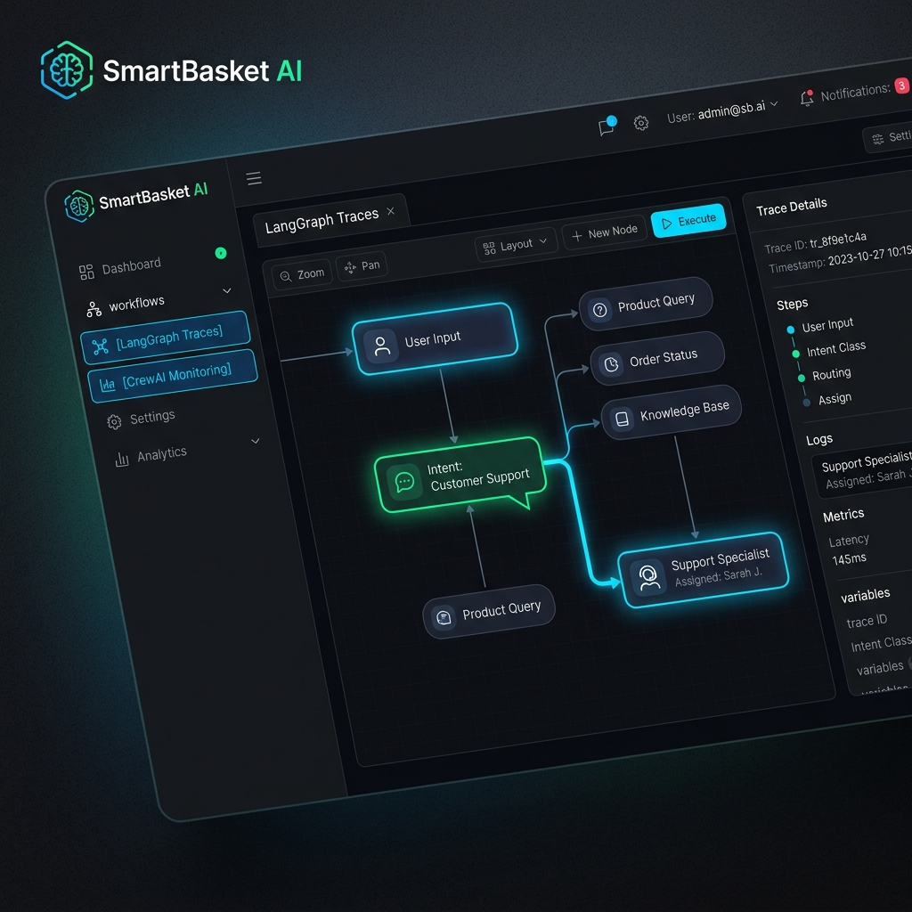
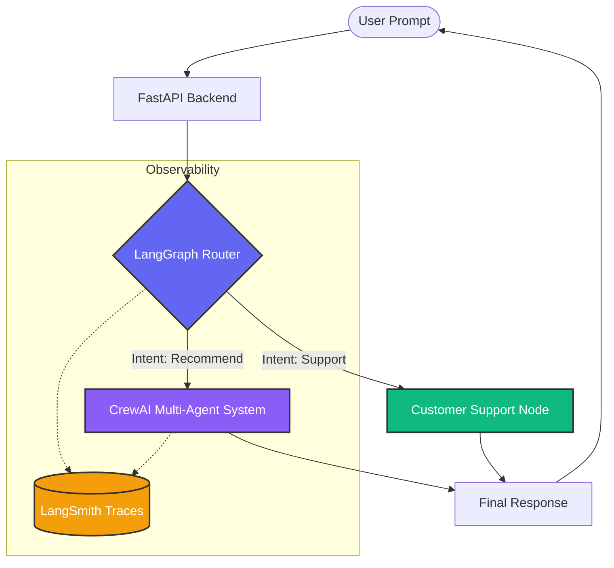
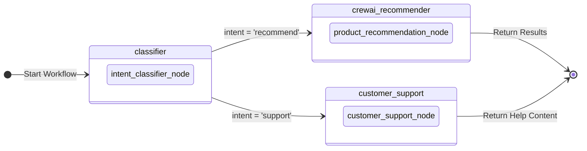

# LangGraph & CrewAI Coordination: Implementation Report
Musa Talat Demir - 20220808022



github repo link:https://github.com/Talatd/advanced-web-project-talat

project link : https://advanced-web-project-talat-pjkc.vercel.app/

## 1. Introduction and Purpose
For modern AI-driven applications, handling diverse user intents robustly is critical. While **CrewAI** is phenomenal for multi-agent collaboration (e.g., getting multiple experts to analyze a user's shopping requirements), it can sometimes lack a deterministic, structured workflow for fundamentally different flows. 

**LangGraph** is incredibly effective at designing *state-machine* style workflows and orchestrations. We introduced LangGraph into the SmartBasket project not as a replacement for CrewAI, but as the **Master Orchestrator**. 

### System Architecture Visualization


### The Architecture
Instead of immediately triggering our CrewAI multi-agent pipeline for every chat message, LangGraph intercepts the user's prompt. 
LangGraph's graph evaluates the intent using a simple rule-based approach (or an LLM). 
- If the user needs **Customer Support** (e.g., "Where is my order?"), LangGraph routes it to a dedicated Customer Support logic node, bypassing CrewAI completely.
- If the user needs **Product Recommendations**, LangGraph intelligently routes it to the existing **CrewAI system** (or our Smart Fallback Recommender).

This ensures both libraries work alongside each other perfectly:
`React Frontend -> FastAPI -> LangGraph (Router) -> CrewAI (Specialists) OR Customer Support (Specialists)`

---

## 2. Implementation Steps

### Step 1: Install Dependencies
We installed the core libraries required for LangGraph and LangSmith (observability):
```bash
pip install langgraph langsmith langchain-core
```
We also updated the `backend/.env.example` file to explicitly showcase how to connect the app to **LangSmith** by setting variables like `LANGCHAIN_TRACING_V2` and `LANGCHAIN_PROJECT`.

### Step 2: Designing the Graph (`backend/graph.py`)
We created the state-machine orchestration workflow in `graph.py` with three distinct nodes:
1. **`intent_classifier_node`**: Examines the state (query text) and classifies the intent into `"recommend"` or `"support"`. 
2. **`customer_support_node`**: Formats a custom response specifically for help/support.
3. **`product_recommendation_node`**: Forwards the query to the existing Recommendation Engine (where CrewAI operates).

We then used LangGraph's routing logic and compiled the app:
```python
workflow = StateGraph(AgentState)
workflow.add_node("classifier", intent_classifier_node)
workflow.add_node("crewai_recommender", product_recommendation_node)
workflow.add_node("customer_support", customer_support_node)

# Defining Edges
workflow.add_edge(START, "classifier")
workflow.add_conditional_edges("classifier", route_by_intent, {
    "recommend": "crewai_recommender",
    "support": "customer_support"
})
smart_router_app = workflow.compile()
```

#### Workflow Graph Visualization


### Step 3: Integrating Graph into Existing Endpoints (`backend/main.py`)
We intentionally avoided creating a new API endpoint, fulfilling the requirement that both CrewAI and LangGraph should work seamlessly in the existing project. 
The `/api/recommend` POST endpoint was refactored:

```python
from graph import run_graph
try:
    graph_out = run_graph(request.query)
    
    if graph_out.get("intent_detected") == "support":
        # Returns standard support string
        return RecommendationResponse(..., result=graph_out["result"])
        
except Exception as e:
    pass

# ... If it is NOT support, the endpoint continues directly into the existing
# Live CrewAI Kickoff workflow or the smart demo engine.
```

---

## 3. LangSmith Observability Context
By wrapping the pipeline execution inside the LangGraph `smart_router_app.invoke(initial_state)` object, we inherently get **LangSmith** tracking capability.

When executed with a valid `LANGCHAIN_API_KEY`, the entire graph resolution—including the payload state moving between the conditional edge from `classifier` to `customer_support`—is visualized in the cloud dashboard automatically. This guarantees that during future classroom demonstrations, we can view step-by-step latency profiling and payload tracking per node.

#### Trace Hierarchy Preview
| Step | Node | Input | Output | Latency |
| :--- | :--- | :--- | :--- | :--- |
| **1** | `__start__` | "Where is my order?" | initial_state | 1ms |
| **2** | `classifier` | initial_state | `{intent: "support"}` | 120ms |
| **3** | `customer_support` | state + intent | `{result: "...Support Content..."}` | 450ms |
| **4** | `__end__` | final_state | result | 1ms |

---

## Conclusion
We have successfully decoupled workflow structure from agentic task execution:
- **LangGraph** manages the deterministic flow, conditionally switching between paths.
- **CrewAI** manages the non-deterministic, creative problem-solving by agents based on the path supplied by LangGraph. 
Both libraries harmonize perfectly in the same project without overriding each other.
